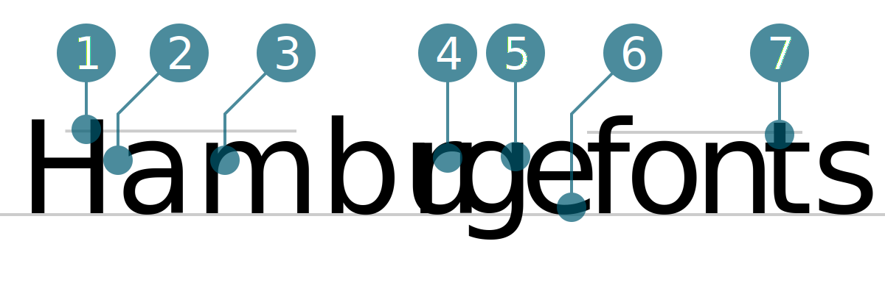

# Mukta Vaani
<small>Lars Mäder</small>

1. Oberkant Oberlänge überragt Versalhöhe
2. Doppelstöckiges (Zweistöckiges) a mit schrägem Anstrich
3. Verjüngung beim Anstrich bei den Buchstaben m, r und n
4. Schräger Abstrich beim Buchstabe r
5. Dreistöckiges g mit geradem Ohr (Fähnchen)
6. Schräger Abstrich beim e
7. Verkürzte Oberlänge beim Buchstabe t

## Design
Mukta Vaani hat ihre Herkunft in Indien und wurde von Noopur Datye und Pallavi Karambelkar entworfen. Sie ist eine vielseitige, zeitgemässe, humanistische und monolineare Schriftfamilie. Als eine Schrift, basierende auf der Sprache Gujarati, gehört sie zum Zweig und Untergruppe der indogermanischen Sprache. Diese wird in Indien, hauptsächlich in Gujarati und Mumbai, gesprochen sowie geschrieben. Die Problematik der indischen Sprache besteht in der Artenvielfalt und ihrer Vielzahl an unterschiedlichen verwendeten Glyphen pro Sprachen. So wird in Indien je nach Region, eine speziell für die örtliche Sprache gezeichnete Schrift benötigt. Ein Beispiel wäre der charakteristische obere Querbalken. In der Sprache Gujarati fehlt dieser gänzlich für den Laut [ta] «ત», in Devanagari dagegen wird der selbe Laut mit Querbalken geschrieben «त». Mukta Vaani verfolgt das Ziel eine harmonische Familie über die Vielzahl aller unterschiedlicher indischen Schriften und Sprachen hinweg zu vereinen, ohne dass die visuellen Merkmale einer Sprache über andere dominieren. Dadurch wird sichergestellt, dass die Schriftart sowohl für einzelne als auch für mehrere Sprachen erfolgreich verwendet werden kann.

## Designer
Noopur Datye ist eine Schriftgestalterin und Kalligraphin aus Mumbai. Sie ist Mitbegründerin von Ek Type – einem kollaborativ Designstudio, das sich auf die Gestaltung zeitgenössischer indischer Schriften konzentriert. Ek Type ist der Herausgeber der Font Mukta Vaani, die Schrift selbst wird jedoch über Google Fonts der Öffentlichkeit als Open-Source-Schrift zur Verfügung gestellt. Ihre Arbeiten umfassen benutzerdefinierte Bengalische- und Devanagari-Schriften für die Fernsehsender Star Jalsa und LifeOk, sowie mehrere Open-Source-Schriften. Ihre Arbeit wurde mit einem D&AD, einem Schwarzen und Blauen Elefanten bei den Kyoorius Design Awards ausgezeichnet und wurde in «365typo» und «Typografica’s favourite typefaces of 2015 and 2016» gezeigt.

Pallavi Karambelkar ist spezialisiert auf Branding, Web, 
User Interface, Digital, Druck und Schriftdesign. Zwei ihrer lateinischen Devanagari Ambigramm Kompositionen wurden durch einen internationalen Wettbewerb ausgewählt und in dem Buch «Ambigrams Revealed by Nikita Prokhorov» veröffentlicht. Ihr Website Design für Wharekauhau Country Estate, welches in Zusammenarbeit mit der Agentur Tomahawk entstand, wurde auf Awwwards mit der Auszeichnung «Site of the Month» nominiert.

#### Quellen
1. [Google Fonts](https://fonts.google.com/specimen/Mukta+Vaani)
2. [Pallavi.com](https://www.pallavi.co.nz/ek-mukta-vaani/)
3. [Wikipedia.org](https://de.wikipedia.org/wiki/Gujarati)
3. [Noopur Datye | Kyoorius Designyatra](http://www.designyatra.com/speaker/noopur-datye/)
3. [Pallavi.co.nz](https://www.pallavi.co.nz/)