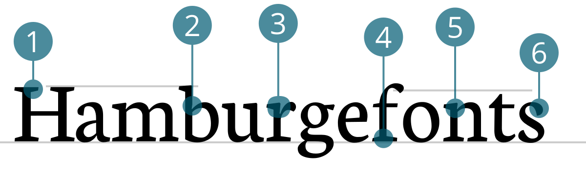

# MariusFont
<small>Marius Becker</small>

1. Serifen auf seiten schräg abgeschnitten
2. einschnitt in Stammstrich -> nicht unbedingt für headlines
3. serifen und zapfen oben rechts angeschnitten
4. Eckige Serifen 
5. Einschnitt in Stammstrich bei Serifen
6. An und Abstriche in Tropfenform

## Design
Neuton ist ein moderner Serifenfont und eignet sich für den Einsatz im Text- und Headlinebereich. Entwickelt wurde die Schrift 2010 von Brian M. Zick, geboren 1991 in Pensylvania, der diese stets erweiterte. Der Font ist nach der dem Newton Country in Arkansas benannt. Mittlerweile stehen 13 Schriftschnitte in Latein und Hebräisch zum freien Gebrauch zur Verfügung.

Neben den Italic-Schnitten von ExtraLight und Regulag gibt es noch eine organischere, schwungvollere Cursive. Zudem gibt es den Font auch in Smallcaps in fünf Schnitten. Die Schriftfamilie kann von verschiedensten Fontanbietern im TTF-Format heruntergeladen werden und steht auch als Webfont bei Google zur Verfügung.

## Designer
Brian M. Zick wurde 1991 in Scranton, Pennsylvania, USA geboren und hatte schon immer Interesse an Schriftzügen und Schriften. Er begann als autodidaktischer Grafik- und Schriftgestalter. Sein Traum, eine Schrift zu entwerfen, wurde 2010 verwirklicht, als er den Font Neuton erschuf, benannt nach Newton County, Arkansas, wo er zu dieser Zeit lebte.

Er hat viele Work-in-Progress-Schriften, die er eines Tages vervollständigen möchte. Er lebt jetzt mit seiner Frau und seinem Sohn in Los Angeles, Kalifornien, und arbeitet im Bereich Programmierung.

#### Quellen
1. [Designer in action](http://www.designerinaction.de/typografie/neuton-von-brian-zick)
2. [Luc Devroye](http://luc.devroye.org/zick.html)
3. [FontSquirrel](http://www.fontsquirrel.com/fonts/neuton)
