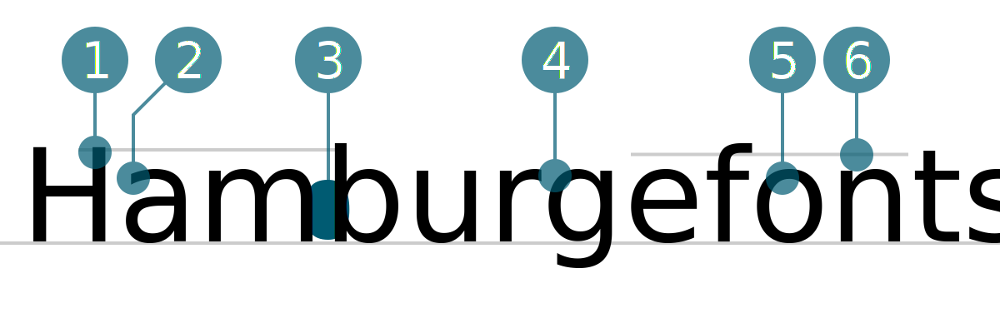

# Ubuntu
<small>Nils Mäder</small>

1. Oberkant Oberlänge überragt Versalhöhe
2. Doppelstöckiges (Zweistöckiges) a mit schrägem Anstrich
3. Geschlossene Punze mit gerader Kante
4. Charakteristische Kante
5. Charakteristische Kante und offene Punze
6. Verkürzte Oberlänge beim t mit schrägem Anstrich

## Design
Der Name Ubuntu bedeutet auf Zulu Menschlichkeit und bezeichnet eine Afrikanische Philosophie. Ubuntu ist vielen als Ubuntu Linux Betriebssystem ein Begriff. Ziel ist ein einfach zu installierendes und leicht zu bedienendes Betriebssystem welches in jeder Sprache bedienbar sein soll zu erschaffen.  Das Projekt wird vom Software-Hersteller Canonical gesponsert, welches vom südafrikanischen Unternehmer Mark Shuttleworth gegründet wurde.

Canonical war es auch, welche die Ubuntu Font Family in Auftrag gab und die Schrift ab der Ubuntu Version 10.10 unter dem Namen Maverick Meerkat (eigenwilliges Erdmännchen)  im Jahre 2010 als Standard verwendete. Ebenfalls wird die Schrift im Ubuntu Logo und anderen Markenzeichen eingesetzt. Die neue Ubuntu Schriftfamilie wurde gestartet, um die Persönlichkeit von Ubuntu in jedem Menü, Knopf und Dialog zu sehen und zu fühlen. Für die Umsetzung der Schrift von 2010 – 2011 war Dalton Maag verantwortlich.  Sowohl die endgültige TrueType/OpenType-Schriftarten sowie die Designdateien die zur Erstellung verwendet wurden, sind unter einer offenen Lizenz verfügbar. Es ist ausdrücklich erwünscht mit der Schrift zu experimentieren, sie zu modifizieren und gegebenenfalls zu verbessern. 

Der Umfang der Ubuntu-Schriftfamilie umfasst alle Sprachen, die von den Ubuntu Benutzern auf der ganzen Welt verwendet werden. Dies steht im Einklang mit Ubuntu Philosophie, dass jeder User in der Lage sein sollte, seine Software in seiner Sprache zu benutzen. Daher ist die FontFamily stetig im Wandel und wird von der Community um weitere Sprachen erweitert. Die Ubuntu FontFamily sollte daher auch als Langzeitprojekt bezeichnet werden. Zuordnen lässt sich die Schrift dem humanistischen Stil, sie umfasst zurzeit 1200 Zeichen, weitere folgen.

Quellen:  
Ubuntu: https://wiki.ubuntu.com/UbuntuFontFamily/History 
Wikipedia: https://de.wikipedia.org/wiki/Ubuntu 
Ubuntu: https://design.ubuntu.com/font/ 
Google Fonts: https://fonts.google.com/specimen/Ubuntu 

## Designer
Dalton Maag ist eine nabhängige Schriftgießerei mit Niederlassungen in London und  São Paulo.  Sie entwerfen Schriftarten die bei Unternehmensidentitäten, Logos und anderen Textverwendungen zum Einsatz kommen. Dalton Maag wurde 1992 vom Schweizer Schriftdesigner Bruno Maag gegründet. In den vergangenen zwei Jahrzehnten haben Bruno und sein Team kontinuierlich daran gearbeitet, eine Boutique-Bibliothek hochwertiger Schriften sowohl für den Einzelhandel als auch für Kunden zu produzieren. 

Viele von Dalton Maags Schriften wurden für Firmenkunden entwickelt. Zu den größeren Kunden von Dalton Maag gehören Netflix, Amazon, Nokia, BMW, Vodafone, Toyota und Ubuntu . Dalton Maag verfügt ab 2016 über eine Bibliothek mit 30 Fonts für den Einzelhandel und bietet seinen Kunden benutzerdefinierte Schriftstellungs- und Änderungsdienste an.

Dalton Maag erregte Publizität, als Nokia Pure für das finnische Mobiltelefonunternehmen Nokia entwickelt wurde, die die frühere von Erik Spiekermann geschaffene Nokia Sans-Schrift ersetzte. Spiekermann kommentierte, dass er enttäuscht sei, dass Dalton Maag ihn nicht über das neue Design konsultiert hatte und bezeichnete das neue Design als fade. Allerdings wurde das neue Design in der in der Öffentlichkeit sehr gut aufgenommen, und im Februar 2012 wurde Nokia Pure für das Design des Jahres 2012 in der Kategorie Grafik nominiert und gewann.

#### Quellen
1. [Ubuntu](https://wiki.ubuntu.com/UbuntuFontFamily/History)
2. [Wikipedia](https://en.wikipedia.org/wiki/Dalton_Maag)
