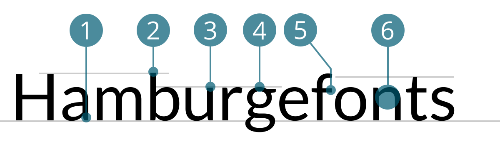

# Lato
<small>Pascale Anderegg</small>

1. Zweistöckiges a mit halb-rundem Abstrich, verjüngt
2. Oberkant Oberlänge überragt Versalhöhe nur minim
3. eher hohe x-Höhe
4. dreistöckiges g mit halb-runder Fahne, verjüngt
5. rechtwinkliger Abstrich bei f  
6. dünner werdender Überlauf (Verjüngung)  

## Design
Lato ist eine serifenlose und freie Schriftart von Łukasz Dziedzic und hat ihren Ursprung in Polen. Sie wurde im Sommer 2010 entwickelt und im Dezember 2010 unter der SIL Open Font License veröffentlicht. Die Schriftart hat ihren Namen von dem polnischen Wort Lato, welches für Sommer steht. Ursprünglich war die Lato für einen grösseren Kunden als Corporate Font-Set konzipiert worden. Dieser Kunde entschied sich aber am Ende für eine andere Stilrichtung und die Familie wurde für die Öffentlichkeit zugänglich. Bei der Entwicklung wurde Łukasz Dziedzic von Google unterstützt. Lato ist daher auch in der Google Font Bibliothek zu finden, wo sie zu den beliebtesten Schriftarten gehört.

Mit den 10 Schnitten wollte der Designer eine Schrift entwerfen, die für Body Text eine transparente Erscheinung aufweist. Ihre besonderen Merkmale sollen in grösseren Schriftgraden und beim genauerem Betrachten sichtbar werden. Er benutzte vor allem in den Oberlängen klassische Proportionen um der Schriftfamilie eine gewohnte Harmonie und Eleganz zu verleihen.

## Designer
Łukasz Dziedzic
Łukasz Dziedzic wurde 1967 in Warschau geboren. Er arbeitete als Tontechniker und gelegentlich als Schauspieler in einer Kinder-Theater-Gruppe. Während der ersten freien polnischen Wahlen 1989 arbeitete er kurz als Zeitungsjunge für Gazeta Wyborcza, die frisch ins Leben gerufene, erste unabhängige Tageszeitung des Landes. Ein Jahr später trat er der Design-Abteilung von Gazeta Wyborcza bei. Dort war er sieben Jahre lang an dem Design der Tageszeitung und deren wöchentlichen Beilagen beteiligt, für die er seine erste Schrift zeichnete. Später arbeitete er für mehrere andere Zeitungsverlage, bei denen er Zeitungen und Zeitschriften mitgestaltete. In dieser Zeit entwickelte Łukasz mehr als ein Dutzend Schriftfamilien, von großen lateinischen und kyrilischen Brotschriftfamilien bis hin zu einzelnen Display-Schnitten. 

In 2007 entwarf Łukasz eine mit drei Schnitten und zwei Alphabeten (Lateinisch, Kyrillisch) angelegte Corporate-Schriftfamilie für empik, einen der größten polnischen Einzelhandelsketten für Bücher, Presse und Musik. Zeitgleich veröffentlichte FontShop International zwei Schriftfamilien von Łukasz Dziedzic (FF Clan und FF Good), mit zwei weiteren Familien in Vorbereitung (FF Pitu und FF More). Die Lato ist sein berühmtester Font, welcher als einziger ein Free-Font ist.

#### Quellen
1. [Wikipedia](https://de.wikipedia.org/wiki/Lato_(Schriftart))
2. [Lato](http://latofonts.com/)
3. [Google Font Bibliothek](http://fonts.google.com/specimen/Lato)
4. [typografie.info] (https://www.typografie.info/3/Personen/wiki.html/lukasz-dziedzic-r259/)
5. [myfonts] (https://www.myfonts.com/person/Lukasz_Dziedzic/)